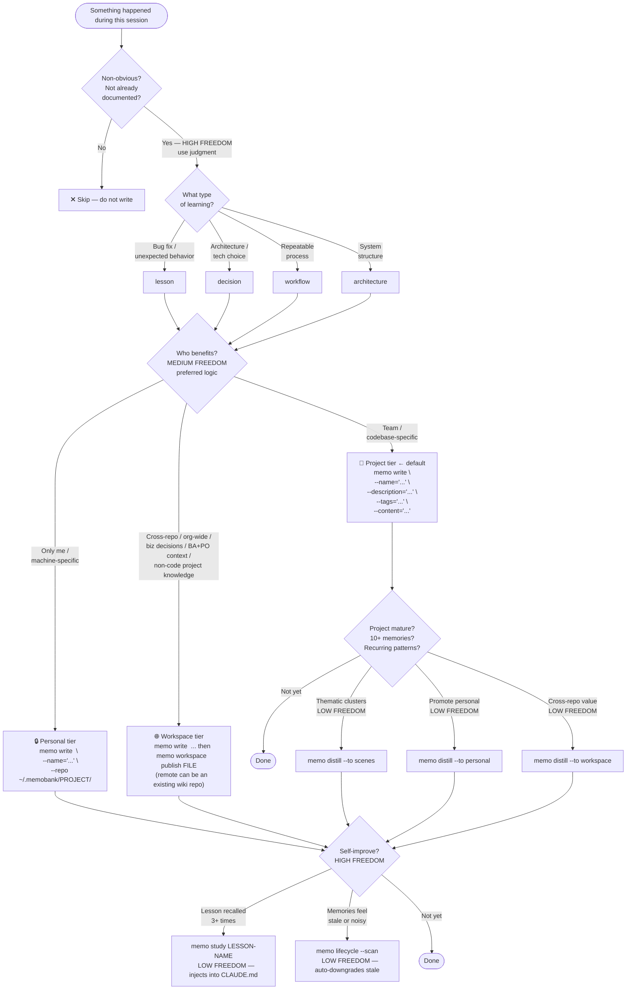

# Memory Decision Tree

Use this diagram to decide **whether to write a memory, which tier to use, and when to distill or self-improve**.

Load this file when: deciding whether an event is worth capturing, choosing a tier, or triggering the self-improvement loop.

## Degree-of-Freedom Key

| Label | Meaning | Examples in this tree |
|-------|---------|----------------------|
| **HIGH FREEDOM** | Use judgment — multiple valid choices | Should I write? Self-improve now? |
| **MEDIUM FREEDOM** | Follow preferred logic, variation OK | Which tier? |
| **LOW FREEDOM** | Exact command, no variation | `memo distill`, `memo study`, `memo lifecycle --scan` |
